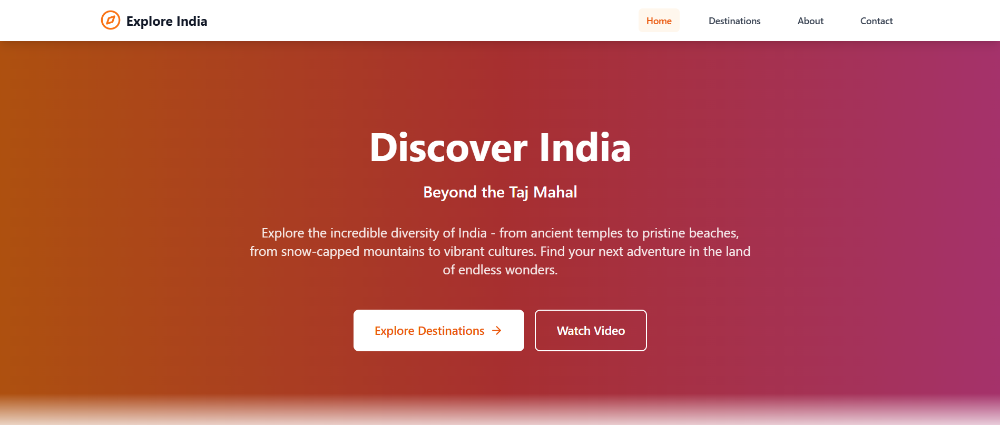
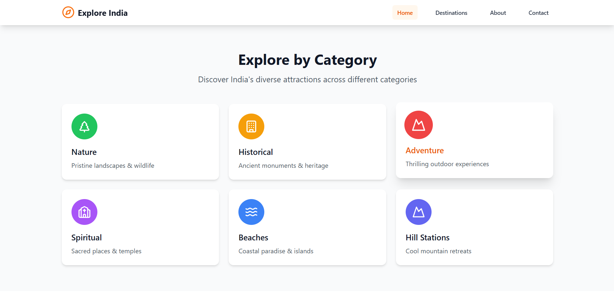
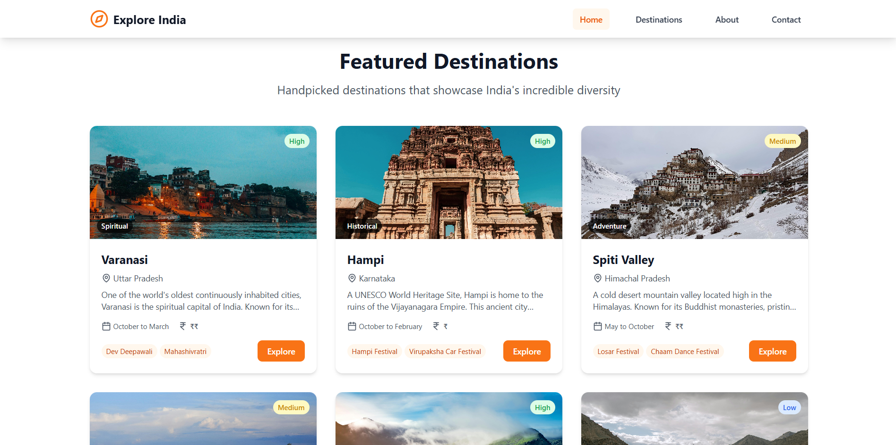
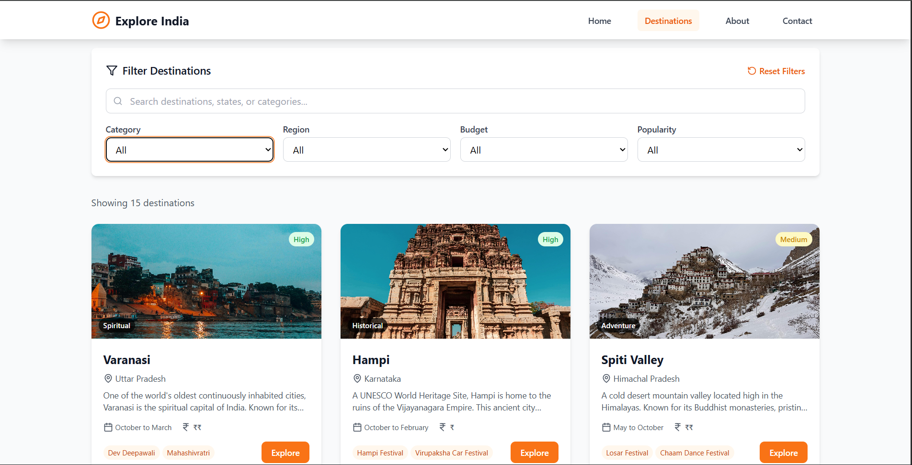
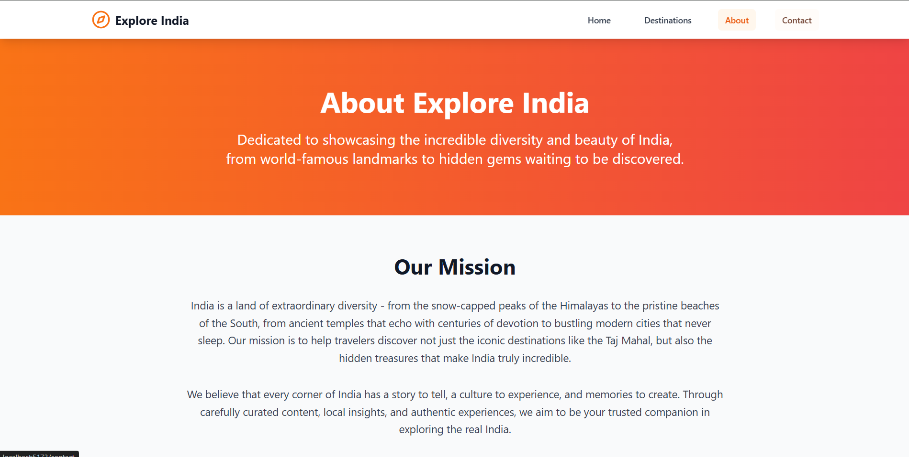
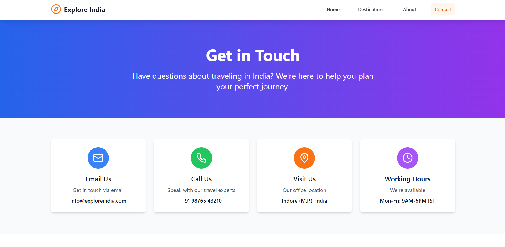

# 🌏 Discover India – Travel Exploration Platform

A modern, responsive **React.js web application** to explore India's top travel destinations — not just the Taj Mahal.  
Built with **React.js**, **Tailwind CSS**, and **React Router DOM**, the platform offers search, filters, and detailed pages for cultural and tourist exploration.  

---

## 🚀 Features  

### 📄 Pages & Routes  
- **Home Page**  
  - Hero section
  - Quick category links (Nature, Historical, Adventure, Spiritual, Beaches, Hill Stations).  
  - Featured destinations.  

- **Destinations Page**  
  - Grid/list of destinations with image, name, and category.  
  - Filters: region, category, budget-friendly, popularity.  
  - Search bar for place, state, or type.  

- **Destination Detail Page**  
  - Overview: history, culture, traditions.  
  - Top Attractions with descriptions & images.  
  - Local Festivals/Events.  
  - Best Time to Visit.  
  - Location Map (Google Maps embed).  
  - Photo Gallery for visual exploration.  

- **About Page** – Platform info & mission.  
- **Contact Page** – Contact form UI (no backend).  

---

### 🧩 Components  
- **Navbar**: Responsive with logo, links to Home, Destinations, Categories, About, Contact.  
- **Footer**: Social links, copyright, and quick links.  
- **DestinationCard**: Destination preview with image, title, and category.  
- **FilterBar**: Reusable filter + search bar component.  
- **Gallery**: Destination detail images.  
- **Map Component**: Google Maps embed or static placeholder.  

---

### ⚙️ State Management  
- **React Context API** or **useState/useEffect** for:  
  - Filters & search queries.  
  - Selected destination for detail page.  

---

### 📊 Mock Data  

Stored in **`/src/data/destinationsData.js`**:  

```js
  {
    id: 1,
    name: "Varanasi",
    state: "Uttar Pradesh",
    region: "North",
    category: "Spiritual",
    overview: "One of the world's oldest continuously inhabited cities, Varanasi is the spiritual capital of India. Known for its ancient ghats along the Ganges, centuries-old temples, and the mesmerizing Ganga Aarti ceremony.",
    attractions: [
      { name: "Dashashwamedh Ghat", description: "Main ghat famous for evening Ganga Aarti ceremony" },
      { name: "Kashi Vishwanath Temple", description: "Ancient temple dedicated to Lord Shiva" },
      { name: "Sarnath", description: "Buddhist pilgrimage site where Buddha gave his first sermon" },
      { name: "Manikarnika Ghat", description: "Sacred cremation ghat" }
    ],
    festivals: ["Dev Deepawali", "Mahashivratri", "Ganga Aarti", "Buddha Purnima"],
    bestTime: "October to March",
    budget: "Moderate",
    popularity: "High",
    images: [
      "https://images.pexels.com/photos/8112552/pexels-photo-8112552.jpeg",
      "https://images.pexels.com/photos/32924878/pexels-photo-32924878.jpeg"
    ],
    location: { lat: 25.3176, lng: 82.9739 }
  },
```

---

## 🛠️ Tech Stack  

- **Frontend**: React.js (Vite) + React Router DOM  
- **Styling**: Tailwind CSS
- **State Management**: React Context API / useState  
- **Maps**: Google Maps embed (or static placeholder)  

---

## 📦 Installation & Setup  

1. Clone the repository:  
   ```bash
   git clone https://github.com/Shaan-d21/Brew-Haven-Modern-React-Cafe-Website.git
   cd explore-india
   ```

2. Install dependencies:  
   ```bash
   npm install
   ```

3. Start development server:  
   ```bash
   npm run dev
   ```

4. Open in browser at **http://localhost:5173/** (default for Vite).  

---

## 🤝 Contributing  

Contributions, issues, and feature requests are welcome.  
Feel free to fork the repo and open a PR.  

---

## 📸 Screenshots (Optional)  







